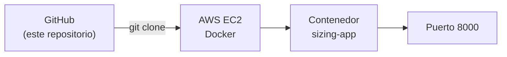

# docker-sizing-lab

Repositorio didáctico y **progresivo** para aprender infraestructura en AWS. Usamos siempre la
**misma aplicación** y el **mismo contenedor**; en cada actividad cambia la infraestructura y la
forma de desplegar, no el código.

## Arquitectura básica



## Requisitos

- Acceso al **Sandbox de AWS Academy** (región `us-east-1`).
- Un navegador (la conexión a EC2 se hace con **EC2 Instance Connect** desde la consola).
- **Terraform** en tu computador, solo para las actividades 04 y 05.
- No necesitas instalar Docker en tu computador: Docker corre dentro de EC2.

## La aplicación

API FastAPI en [`app/main.py`](app/main.py), empaquetada por el [`Dockerfile`](Dockerfile).
**Escucha en el puerto 8000.**

| Endpoint | Qué hace |
| --- | --- |
| `GET /health` | responde `{"status":"ok"}`; consumo mínimo |
| `GET /compute` | cuenta números primos por fuerza bruta (`?n=`); consume CPU |
| `GET /memory` | reserva memoria (`?mb=`) unos segundos (`?hold_seconds=`) |
| `GET /docs` | documentación interactiva que FastAPI genera automáticamente |

Para probarla en cualquier máquina con Docker:

```bash
docker build -t sizing-app .
docker run -d --name sizing-app -p 8000:8000 sizing-app
curl http://localhost:8000/health
```

## Actividades

Cada actividad agrega **una** idea nueva sobre la anterior.

| # | Actividad | Idea nueva |
| --- | --- | --- |
| 1 | [EC2 manual + Docker](actividades/01-ec2-manual/README.md) | crear una EC2 y ejecutar el contenedor |
| 2 | [Security Groups](actividades/02-security-groups/README.md) | por qué funciona en `localhost` y no desde Internet |
| 3 | [User Data](actividades/03-user-data/README.md) | automatizar el despliegue con un script |
| 4 | [Terraform EC2](actividades/04-terraform-ec2/README.md) | crear Security Group y EC2 con código |
| 5 | [Terraform VPC](actividades/05-terraform-vpc/README.md) | construir la red (VPC, subnet, gateway, rutas) |
| 6 | [Dimensionamiento](actividades/06-dimensionamiento/README.md) | medir la carga y elegir el tipo de instancia |

## Estructura del repositorio

```
app/            aplicación FastAPI (no cambia entre actividades)
Dockerfile      receta de la imagen (no cambia entre actividades)
requirements.txt
actividades/    guías paso a paso, una carpeta por actividad
load-tests/     pruebas de carga con k6 (Actividad 06)
docs/           documentación de apoyo (arquitectura.md)
```

Más detalle en [`docs/arquitectura.md`](docs/arquitectura.md).

> **Seguridad:** en ninguna actividad se abre el puerto SSH (22) a `0.0.0.0/0`.
> Las actividades usan la lista de prefijos administrada de **EC2 Instance Connect**.
