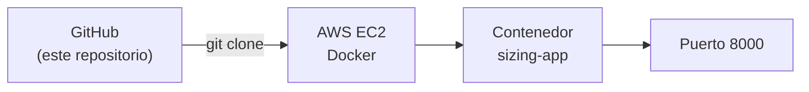

# aws-infrastructure-labs

Repositorio didáctico y **progresivo** para aprender infraestructura en AWS. Se usa siempre la
**misma aplicación** y el **mismo contenedor**; en cada actividad cambia la infraestructura y la
forma de desplegar, no el código.

> Las **guías de cada actividad** se entregan en PDF en la actividad correspondiente de **Teams**.
> Este repositorio contiene el código que esas guías usan.

## Arquitectura básica


```mermaid
flowchart LR
    GH["GitHub<br/>(este repositorio)"] -->|"git clone"| EC2["AWS EC2<br/>Docker"]
    EC2 --> C["Contenedor<br/>sizing-app"]
    C --> P["Puerto 8000"]
```

## Requisitos

- Acceso al **Sandbox de AWS Academy** (región `us-east-1`).
- Un navegador (la conexión a EC2 se hace con **EC2 Instance Connect** desde la consola).
- **Terraform** en el computador del estudiante, solo para las actividades 04 y 05.
- No se necesita Docker en el computador del estudiante: Docker corre dentro de EC2.

## La aplicación

API FastAPI en [`app/main.py`](app/main.py), empaquetada por el [`Dockerfile`](Dockerfile).
**Escucha en el puerto 8000.**

| Endpoint | Qué hace |
| --- | --- |
| `GET /health` | responde `{"status":"ok"}`; consumo mínimo |
| `GET /compute` | cuenta números primos por fuerza bruta (`?n=`); consume CPU |
| `GET /memory` | reserva memoria (`?mb=`) unos segundos (`?hold_seconds=`) |
| `GET /docs` | documentación interactiva que FastAPI genera automáticamente |

Para probarla en cualquier máquina con Docker:

```bash
docker build -t sizing-app .
docker run -d --name sizing-app -p 8000:8000 sizing-app
curl http://localhost:8000/health
```

## Actividades

Cada actividad agrega **una** idea nueva sobre la anterior.

| # | Actividad | Idea nueva | Código en este repositorio |
| --- | --- | --- | --- |
| 1 | EC2 manual + Docker | crear una EC2 y ejecutar el contenedor | `app/`, `Dockerfile` |
| 2 | Security Groups | por qué funciona en `localhost` y no desde Internet | — |
| 3 | User Data | automatizar el despliegue con un script | [`infra/user-data.sh`](infra/user-data.sh) |
| 4 | Terraform EC2 | crear Security Group y EC2 con código | [`infra/terraform-ec2/`](infra/terraform-ec2/) |
| 5 | Terraform VPC | construir la red (VPC, subnet, gateway, rutas) | [`infra/terraform-vpc/`](infra/terraform-vpc/) |
| 6 | Dimensionamiento | medir la carga y elegir el tipo de instancia | [`load-tests/`](load-tests/) |

## Estructura del repositorio

```
app/            aplicación FastAPI (no cambia entre actividades)
Dockerfile      receta de la imagen (no cambia entre actividades)
requirements.txt
infra/          script de arranque (User Data) y código Terraform
load-tests/     pruebas de carga con k6 (Actividad 06)
```

> **Seguridad:** en ninguna actividad se abre el puerto SSH (22) a `0.0.0.0/0`.
> Las actividades usan la lista de prefijos administrada de **EC2 Instance Connect**.
