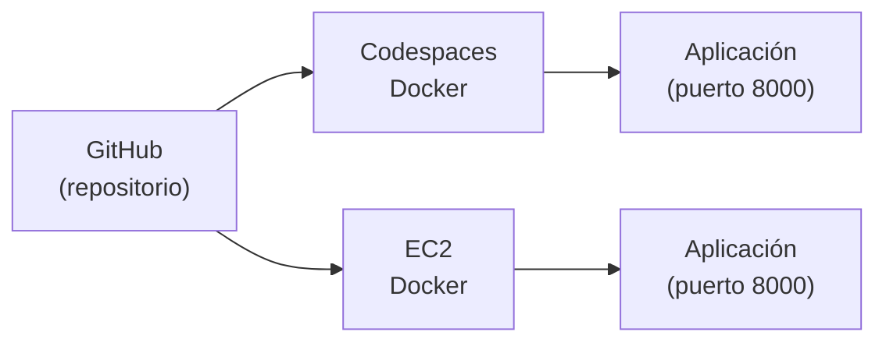
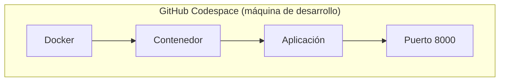
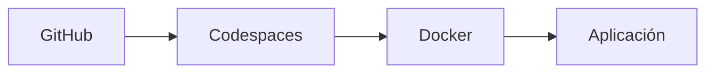
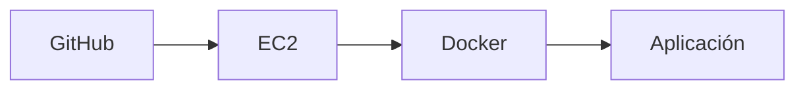
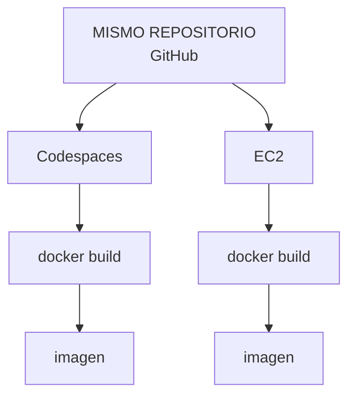
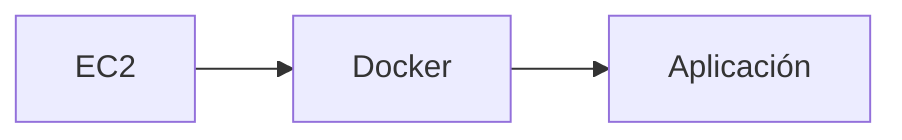
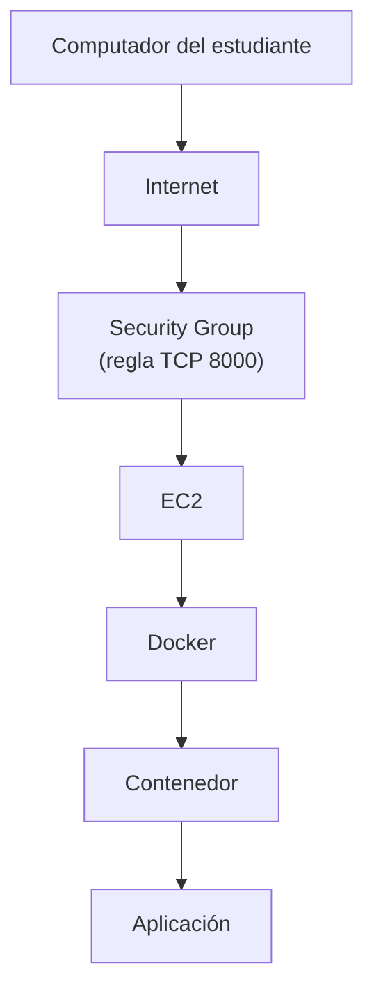

# Actividad 02 — Del contenedor local a AWS EC2

**Idea central de esta actividad:**

> Construimos una aplicación contenerizada en un entorno y somos capaces de
> reproducirla en otra máquina.

Vas a ejecutar la **misma aplicación** dos veces: primero en **GitHub Codespaces** y
después en una máquina virtual de **AWS EC2**. Nada se copia de una a otra: las dos
partirán del mismo repositorio en GitHub.



**Qué NO vas a ver todavía** (vendrán en otras actividades): Terraform, ECR / registros de
imágenes, automatización, CI/CD, ECS, Kubernetes.

**Cómo está escrita:** en cada parte verás *explicación corta → comando → qué debo
observar → pregunta → checkpoint*. Escribe tus respuestas en un documento aparte; las
necesitarás para la entrega.

> **Sobre las respuestas:** las preguntas de cada parte tienen una respuesta oculta
> (`Ver respuesta`). Responde primero por tu cuenta y solo después ábrela.

---

## Los cinco conceptos que vas a separar

| Concepto | Qué es |
| --- | --- |
| **Repositorio** | La carpeta de código en GitHub (`git clone` la copia a otra máquina). |
| **Aplicación** | El programa que queremos ejecutar (aquí, una API en Python). |
| **Imagen Docker** | La plantilla empaquetada de la aplicación, construida con `docker build`. |
| **Contenedor** | Una ejecución de la imagen, creada con `docker run`. |
| **Máquina virtual (EC2)** | El servidor en AWS donde corre Docker. |

---

# PARTE 1 — Abrir el repositorio en GitHub Codespaces

**Codespaces** es una máquina de desarrollo en la nube asociada al repositorio.
No necesitas instalar Docker en tu computador: ya viene dentro del Codespace.

1. Abre el repositorio: <https://github.com/OpinzonUPB/docker-sizing-lab>
2. Pulsa el botón verde **Code**.
3. Abre la pestaña **Codespaces**.
4. Pulsa **Create codespace on main** (no necesitas hacer fork).
5. Espera a que se abra VS Code en el navegador (la primera vez tarda 1–2 minutos).
6. Abre una terminal: menú **Terminal → New Terminal**.

**Comandos** (en la terminal del Codespace):

```bash
pwd
ls
git status
```

**Qué debo observar**

- `pwd` muestra una ruta que termina en `/docker-sizing-lab`.
- `ls` muestra `app`, `Dockerfile`, `requirements.txt`, `README.md`, entre otros.
- `git status` dice `On branch main` y `nothing to commit, working tree clean`.

> **CHECKPOINT 1 — Estoy dentro del repositorio en Codespaces.**

---

# PARTE 2 — Revisar las piezas del proyecto

Antes de usar Docker, reconoce solamente estas piezas en el explorador de archivos
(panel izquierdo):

- `Dockerfile`
- `requirements.txt`
- la carpeta `app/`
- el archivo principal de la aplicación: `app/main.py`

| Pieza | Función |
| --- | --- |
| Código | contiene la aplicación |
| Dockerfile | indica cómo construir la imagen |
| Imagen | plantilla empaquetada de la aplicación |
| Contenedor | ejecución de la imagen |

**Pregunta:** ¿Cuál archivo le indica a Docker cómo construir la imagen?

<details><summary>Ver respuesta</summary>

El `Dockerfile`.

</details>

---

# PARTE 3 — Construir la imagen Docker en Codespaces

`docker build` construye una imagen a partir del `Dockerfile`.

```bash
docker build -t sizing-app .
```

Cuando termine:

```bash
docker images
```

**Qué debo observar**

- Al final de `docker build` no hay errores.
- `docker images` lista una imagen llamada `sizing-app` (de unos 240 MB).

**Pregunta:** ¿La aplicación ya está ejecutándose después de `docker build`?

<details><summary>Ver respuesta</summary>

No. `docker build` solo crea la imagen (la plantilla). Para ejecutarla hay que crear un
contenedor con `docker run`.

</details>

> **CHECKPOINT 2 — La imagen Docker fue creada.**

---

# PARTE 4 — Crear el contenedor

```bash
docker run -d \
  --name sizing-app \
  -p 8000:8000 \
  sizing-app
```

Luego:

```bash
docker ps
```

Qué significa cada parte:

| Parte | Significado |
| --- | --- |
| `-d` | ejecuta el contenedor en segundo plano |
| `--name sizing-app` | le pone un nombre al contenedor |
| `-p 8000:8000` | conecta el puerto 8000 de la máquina con el puerto 8000 del contenedor |
| `sizing-app` (al final) | la **imagen** que se va a ejecutar |

**Qué debo observar:** `docker ps` muestra una fila con `NAMES = sizing-app` y
`STATUS = Up ...`.

> Si aparece el error `The container name "/sizing-app" is already in use`, quedó un
> contenedor de una práctica anterior. Ejecuta `docker rm -f sizing-app` y repite el
> `docker run`.

> **CHECKPOINT 3 — El contenedor está ejecutándose.**

---

# PARTE 5 — Probar la aplicación en Codespaces

```bash
curl http://localhost:8000/health
curl http://localhost:8000/compute
```

**Qué debo observar**

- `/health` responde `{"status":"ok"}`.
- `/compute` responde un JSON con `primes_found` y `elapsed_ms` (cuántos milisegundos
  tardó en calcular).

**Opcional — verlo en el navegador:** abre la pestaña **PORTS** (junto a la terminal),
busca el puerto `8000` y pulsa el icono del globo (*Open in Browser*). Agrega `/health` al
final de la URL.

La aplicación se está ejecutando **dentro del Codespace**:



**Pregunta:** ¿Dónde está ejecutándose actualmente el contenedor?

<details><summary>Ver respuesta</summary>

Dentro del Codespace de GitHub, no en tu computador ni en AWS.

</details>

> **CHECKPOINT 4 — La aplicación funciona en Codespaces.**

📸 **Evidencia 1 y 2:** captura de `docker ps` y de la respuesta de `/health`
(terminal o navegador).

---

# PARTE 6 — Preparar el salto a AWS

Hasta ahora:



Ahora vamos a repetirlo en otra máquina:



**No vamos a copiar archivos** desde Codespaces hacia EC2. GitHub será la fuente común.
En EC2 repetiremos: `git clone` → `docker build` → `docker run`.

**Pregunta:** Si clonamos exactamente el mismo repositorio, ¿deberíamos obtener la misma
aplicación?

<details><summary>Ver respuesta</summary>

Sí: el código y el `Dockerfile` son los mismos, así que la imagen que se construya será
equivalente.

</details>

---

# PARTE 7 — Crear manualmente una instancia EC2

Una **instancia EC2** es una máquina virtual (un servidor) en AWS. En esta actividad la
creas a mano desde la consola web.

> ⚠️ **AWS Academy Learner Lab / Sandbox**
>
> - Entra a tu curso en AWS Academy → **Learner Lab** → pulsa **Start Lab**. Espera a que
>   el círculo junto a **AWS** se ponga **verde** y pulsa **AWS** para abrir la consola.
> - Trabaja en la región **N. Virginia (us-east-1)**. Es la región habitual del Learner
>   Lab; si el tuyo indica otra, usa esa.
> - El Sandbox solo permite instancias pequeñas. Si no te deja crear una, prueba con un
>   tipo más pequeño.

En la consola: **EC2 → Instances → Launch instances**. Configura **solo** esto:

| Campo | Valor |
| --- | --- |
| **Name** | `docker-ec2-TU-NOMBRE` |
| **Application and OS Images** | **Ubuntu** → *Ubuntu Server 24.04 LTS* (arquitectura 64-bit x86) |
| **Instance type** | `t3.micro` (si no aparece, `t2.micro`) |
| **Key pair** | *Proceed without a key pair* (usaremos EC2 Instance Connect). Si tu laboratorio lo exige, elige `vockey`. |
| **Network settings → Auto-assign public IP** | **Enable** |
| **Firewall (Security group)** | *Create security group* con las dos reglas de abajo |
| **Storage** | el valor por defecto |

**Security Group:** controla qué tráfico puede entrar a la instancia. Deja estas dos
reglas de entrada (*inbound*):

| Puerto | Uso | Tipo en la consola | Origen (Source) |
| --- | --- | --- | --- |
| 22 | conexión SSH | SSH | Anywhere (`0.0.0.0/0`) |
| 8000 | aplicación | Custom TCP | Anywhere (`0.0.0.0/0`) |

Para agregar la regla del 8000 pulsa **Add security group rule**, elige **Custom TCP**,
escribe `8000` en *Port range* y `0.0.0.0/0` en *Source*.

> Abrir a "Anywhere" es aceptable solo para esta práctica de corta duración. En un
> sistema real se restringe a tu IP o a la red que corresponda.

Pulsa **Launch instance**. Ve a **Instances** y espera a que `Instance state` sea
`Running` y `Status check` muestre `2/2 checks passed`. Selecciona tu instancia y anota:

| Dato | Valor |
| --- | --- |
| Instance ID (`i-...`) | |
| Instance type | |
| Public IPv4 address | |

> ⚠️ La IP pública **cambia** si la instancia se detiene y se vuelve a iniciar (por
> ejemplo, al terminar la sesión del Learner Lab). Si eso pasa, vuelve a copiar la IP
> nueva desde la consola.

> **CHECKPOINT 5 — La instancia EC2 está ejecutándose.**

📸 **Evidencia 3:** captura de la instancia en la consola (con estado *Running*, Instance ID
y IPv4 pública visibles).

---

# PARTE 8 — Conectarse a EC2

Usaremos **EC2 Instance Connect**, que abre una terminal en el navegador (no hay que
instalar nada ni manejar llaves).

1. En **EC2 → Instances**, selecciona tu instancia.
2. Pulsa **Connect**.
3. En la pestaña **EC2 Instance Connect**, deja el usuario `ubuntu` y pulsa **Connect**.

Se abre una terminal nueva. Ejecuta:

```bash
pwd
whoami
uname -a
```

**Qué debo observar**

- `pwd` muestra `/home/ubuntu`.
- `whoami` muestra `ubuntu`.
- `uname -a` muestra `Linux ip-... aws` (el nombre de una máquina de AWS).

**Ahora la terminal ya no pertenece a Codespaces. Estás dentro de una máquina virtual
EC2.** Es fácil confundirse, así que fíjate:

| Terminal | Máquina |
| --- | --- |
| Codespaces | entorno de desarrollo de GitHub |
| EC2 | servidor virtual en AWS |

> Si Instance Connect falla, comprueba que la instancia está `Running` y que el Security
> Group tiene la regla del puerto 22. Si tu profesor lo autoriza, también puedes conectarte
> por SSH usando la llave `vockey.pem` que ofrece el Learner Lab.

---

# PARTE 9 — Instalar Docker en EC2

Estás en la terminal de **EC2**. Instala Docker y Git desde los repositorios de Ubuntu:

```bash
sudo apt-get update
sudo apt-get install -y docker.io git
```

Comprueba:

```bash
sudo docker --version
sudo docker run hello-world
```

**Qué debo observar:** la versión de Docker y un mensaje que empieza con
`Hello from Docker!`.

> En EC2 escribiremos **`sudo docker ...`** en todos los comandos de Docker. Tu usuario
> `ubuntu` todavía no tiene permiso para hablar con Docker sin `sudo`, y para esta
> práctica es lo más simple.

> **CHECKPOINT 6 — Docker funciona dentro de EC2.**

---

# PARTE 10 — Clonar el mismo repositorio

Sigues en **EC2**:

```bash
git clone https://github.com/OpinzonUPB/docker-sizing-lab.git
cd docker-sizing-lab
ls
git status
```

**Qué debo observar:** `ls` muestra los mismos archivos que viste en Codespaces
(`app`, `Dockerfile`, `requirements.txt`...) y `git status` dice `On branch main` y
`nothing to commit, working tree clean`.

Ahora tenemos una copia del mismo proyecto, pero esta vez dentro de EC2.

**Pregunta:** ¿El repositorio que está en EC2 es diferente al que utilizamos en
Codespaces?

<details><summary>Ver respuesta</summary>

No. Es el mismo repositorio de GitHub; solo cambia la máquina donde está la copia.

</details>

---

# PARTE 11 — Construir la imagen dentro de EC2

```bash
sudo docker build -t sizing-app .
sudo docker images
```

**Qué debo observar:** termina sin errores y `docker images` muestra `sizing-app`. La
primera vez tarda un par de minutos porque debe descargar la imagen base de Python.

**No estamos copiando la imagen creada en Codespaces.** Usamos el mismo `Dockerfile` para
construir una imagen nueva dentro de EC2:



**Pregunta:** ¿Por qué Docker ayuda a que ambos entornos construyan una aplicación
equivalente?

<details><summary>Ver respuesta</summary>

Porque el `Dockerfile` describe todo lo necesario (versión de Python, dependencias, código
y comando de arranque). Cada máquina solo necesita Docker; no depende de lo que tenga
instalado.

</details>

---

# PARTE 12 — Ejecutar el contenedor en EC2

```bash
sudo docker run -d \
  --name sizing-app \
  -p 8000:8000 \
  sizing-app
```

```bash
sudo docker ps
curl http://localhost:8000/health
```

**Qué debo observar:** `docker ps` muestra `sizing-app` con `Up ...` y `curl` responde
`{"status":"ok"}`.

Esta prueba se hace **desde la propia instancia EC2** (`localhost` es la misma máquina).
Si funciona, sabemos que estas piezas funcionan:



> **CHECKPOINT 7 — La aplicación funciona dentro de EC2.**

📸 **Evidencia 4:** captura de `sudo docker ps` dentro de EC2.

---

# PARTE 13 — Acceder desde Internet

Ahora la prueba real: llamar a la aplicación **desde tu computador**, no desde EC2.

1. Copia la **Public IPv4 address** de tu instancia (consola de AWS).
2. En el navegador de tu computador abre (usa `http://`, **no** `https://`):

   ```
   http://IP_PUBLICA:8000/health
   ```

   O desde una terminal de tu computador:

   ```bash
   curl http://IP_PUBLICA:8000/health
   ```

**Qué debo observar:** `{"status":"ok"}`, igual que antes.



Lo que debes entender de este recorrido:

- la aplicación escucha en el puerto **8000**;
- Docker **publica** ese puerto (`-p 8000:8000`);
- AWS **permite** el acceso gracias a la regla del Security Group;
- la **IP pública** identifica tu instancia desde Internet.

> **CHECKPOINT 8 — La aplicación responde desde Internet.**

📸 **Evidencia 5:** captura de `/health` respondiendo usando la **IP pública** (se debe ver
la IP en la barra del navegador o en el comando).

---

# PARTE 14 — Comparar los dos entornos

Completa esta tabla con lo que observaste:

| Elemento | Codespaces | EC2 |
| --- | --- | --- |
| Repositorio | | |
| Dockerfile | | |
| imagen Docker | | |
| contenedor | | |
| aplicación | | |
| máquina donde se ejecuta | | |
| dirección para acceder | | |

**Preguntas finales** (respuestas cortas, 1–2 líneas):

1. ¿Qué elementos fueron iguales en Codespaces y EC2?
2. ¿Qué elemento cambió?
3. ¿Qué función cumple GitHub?
4. ¿Qué función cumple Docker?
5. ¿Qué función cumple EC2?
6. ¿Por qué utilizamos el mismo Dockerfile en los dos entornos?
7. ¿Qué diferencia existe entre una imagen y un contenedor?

---

# PARTE 15 — Diagnóstico sencillo

Si la aplicación no responde desde Internet, revisa **en este orden**:

**1. ¿Está ejecutándose Docker / el contenedor?** (en EC2)

```bash
sudo docker ps
```

Debe aparecer `sizing-app` con `Up`. Si no aparece, mira por qué con
`sudo docker logs sizing-app` o vuelve a ejecutar el `docker run`.

**2. ¿Responde dentro de EC2?** (en EC2)

```bash
curl http://localhost:8000/health
```

Si esto falla, el problema está en el contenedor, no en AWS.

**3. ¿Está abierto el puerto en AWS?** (en la consola)

EC2 → Instances → tu instancia → pestaña **Security** → mira **Inbound rules**. Debe
existir una regla **TCP 8000** con origen `0.0.0.0/0`. Si falta, agrégala con
**Edit inbound rules**.

> Si las tres cosas están bien y aun así no abre, comprueba que usas la IP pública actual
> (puede haber cambiado) y que escribes `http://`, no `https://`.

---

# PARTE 16 — Limpieza

En la terminal de **EC2** (y también en la de Codespaces si quieres dejarlo limpio):

```bash
sudo docker stop sizing-app
sudo docker rm sizing-app
```

(En Codespaces se escriben sin `sudo`.)

**Muy importante — termina la instancia EC2:**

1. En la consola: **EC2 → Instances**, selecciona tu instancia.
2. **Instance state → Terminate (delete) instance** y confirma.
3. Verifica que el estado pase a `Terminated`.

Así no consumes recursos ni presupuesto de tu Sandbox innecesariamente. *Detener*
(`Stop`) no basta si ya terminaste la práctica: la instancia y su disco siguen existiendo.

Para no gastar horas gratuitas, en GitHub también puedes detener el Codespace
(<https://github.com/codespaces> → `...` → **Stop codespace**).

---

# Evidencias de entrega

Entrega un único documento (PDF o Word) con:

1. captura de `docker ps` en Codespaces;
2. respuesta de `/health` funcionando en Codespaces;
3. captura de la instancia EC2 creada;
4. captura de `sudo docker ps` dentro de EC2;
5. respuesta de `/health` usando la **IP pública**;
6. la tabla comparativa Codespaces vs EC2 (Parte 14);
7. respuestas cortas a las siete preguntas finales.

---

<details>
<summary><strong>Nota para el docente — cómo probar esta actividad antes de asignarla</strong></summary>

**Qué está verificado y qué no.** Los comandos de las Partes 3–5 y 11–12 (`docker build`,
`docker run`, `docker ps`, `/health`, `/compute`) se ejecutaron con Docker 29.x y funcionan
con el repositorio actual. Se comprobó que `docker.io` y `git` existen en los repositorios
de Ubuntu 24.04. **No se pudo probar** en un Codespace real, en AWS Academy ni con EC2
Instance Connect: las Partes 1, 7, 8, 9, 10 y 13 requieren que las corras tú una vez.

**Prueba completa (≈ 30–40 min):**

1. Con una cuenta de GitHub distinta a la tuya (o en ventana privada), abre el repo y crea
   un Codespace. Ejecuta las Partes 1–5. Confirma que `docker` funciona sin instalar nada
   y que el puerto 8000 se reenvía en la pestaña **PORTS**.
2. En AWS Academy: **Start Lab**, abre la consola y crea la instancia exactamente como dice
   la Parte 7. Confirma que:
   - `t3.micro` (o `t2.micro`) y la AMI Ubuntu 24.04 están permitidas en tu Learner Lab;
   - *Proceed without a key pair* está permitido (si no, usa `vockey`);
   - **EC2 Instance Connect** abre la terminal (si tu laboratorio lo bloquea, decide si
     los estudiantes usarán SSH con `vockey.pem` y ajusta la Parte 8).
3. Ejecuta las Partes 9–13. Tras `apt-get install docker.io` verifica que
   `sudo docker run hello-world` funciona y que `http://IP_PUBLICA:8000/health` responde
   desde fuera de AWS. Si la red de tu institución bloquea el puerto 8000 saliente, prueba
   desde datos móviles.
4. Termina la instancia (Parte 16) y confirma que aparece `Terminated`.

**Advertencias específicas del Learner Lab:**

- La sesión del laboratorio dura unas 4 horas; al expirar, las instancias se **detienen** y
  la IP pública **cambia** al reiniciarlas.
- Cada estudiante trabaja en su propia cuenta de Sandbox: no comparten Security Groups ni
  instancias.
- Los Codespaces consumen las horas gratuitas mensuales de cada estudiante; conviene que
  los detengan al terminar.
- El repositorio debe seguir siendo **público**: si pasa a privado, `git clone` en EC2
  pedirá credenciales.

</details>
