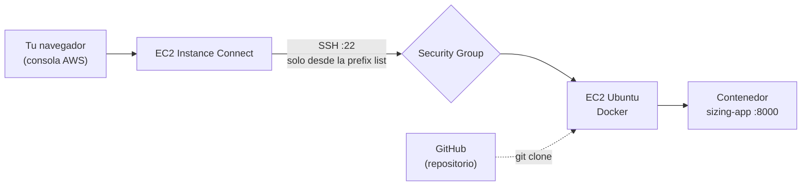

# Actividad 01 — EC2 manual + Docker

## Objetivo

Crear **a mano**, desde la consola de AWS Academy, una máquina virtual EC2 y ejecutar en ella
la aplicación contenerizada de este repositorio.

## Qué aprenderá

- Qué es una instancia EC2 y cómo se crea desde la consola.
- Qué VPC y subnet usa una instancia, y la diferencia entre IP privada e IP pública.
- Cómo un Security Group protege el puerto SSH (y por qué **no** se abre a todo Internet).
- Cómo conectarse con **EC2 Instance Connect**, sin llaves `.pem`.
- El flujo `git clone` → `docker build` → `docker run` dentro de EC2.

## Arquitectura



En esta actividad **solo** el puerto 22 tiene regla de entrada. La aplicación (puerto 8000) la
probaremos desde dentro de la propia instancia; abrirla al exterior es la Actividad 02.

## Prerrequisitos

- Acceso al Sandbox de AWS Academy: entra a tu curso → **Start Lab**, espera el círculo
  **verde** junto a *AWS* y pulsa **AWS** para abrir la consola.
- Trabaja en la región **N. Virginia (`us-east-1`)**. Verifícalo en la esquina superior derecha.
- No hace falta instalar nada en tu computador. **No uses** la instancia preconfigurada del
  laboratorio: crearás la tuya.

> ⚠️ El Sandbox solo permite instancias pequeñas. Si una opción de esta guía no te deja
> continuar, elige un tipo de instancia más pequeño.

---

## Paso 1 — Crear el Security Group

Un **Security Group** es el firewall de la instancia: define qué tráfico puede **entrar**.
Lo creamos primero para poder asignarlo al lanzar la instancia.

**EC2 → Network & Security → Security Groups → Create security group**

| Campo | Valor |
| --- | --- |
| Security group name | `docker-sizing-sg` *(AWS no permite nombres que empiecen por `sg-`)* |
| Description | `Actividad EC2 Docker` |
| VPC | la que dice **(default)** |

En **Inbound rules → Add rule**:

| Type | Protocol | Port | Source |
| --- | --- | --- | --- |
| SSH | TCP | 22 | **Custom** → busca `ec2-instance-connect` y elige `com.amazonaws.us-east-1.ec2-instance-connect` |

Deja **Outbound rules** como están (permiten salir a Internet; la instancia lo necesita para
instalar paquetes y clonar el repositorio). Pulsa **Create security group**.

### ¿Por qué esa "prefix list" y no `0.0.0.0/0`?

Cuando usas el botón **Connect** de la consola, la conexión SSH no sale de tu computador: la
abre el servicio **EC2 Instance Connect** desde direcciones de AWS. AWS publica esas direcciones
en una **lista de prefijos administrada** (`com.amazonaws.<región>.ec2-instance-connect`) y la
mantiene actualizada. Así el puerto 22 solo acepta al servicio de conexión de AWS.

| Origen del puerto 22 | Quién puede intentar entrar | ¿Se recomienda? |
| --- | --- | --- |
| `0.0.0.0/0` | **Cualquier equipo de Internet** (robots que escanean el puerto 22 todo el tiempo) | **No.** Nunca lo uses para SSH |
| **My IP** | Solo tu IP pública actual | Sí, si te conectas por SSH **desde tu computador**. **No sirve** con el botón Connect de la consola, porque esa conexión no sale de tu IP |
| **Prefix list de EC2 Instance Connect** | Solo el servicio EC2 Instance Connect de esa región | **Sí**, para conectarse desde la consola |

> **Si la prefix list no aparece o el Sandbox no te deja usarla:** avisa al docente. La
> alternativa documentada es usar el rango del servicio para tu región, publicado en
> <https://ip-ranges.amazonaws.com/ip-ranges.json> (entradas con `"service": "EC2_INSTANCE_CONNECT"`
> y `"region": "us-east-1"`; al escribir esta guía era `18.206.107.24/29`). Confirma el valor
> vigente en ese archivo. **Nunca** uses `0.0.0.0/0`.

---

## Paso 2 — Lanzar la instancia

**EC2 → Instances → Launch instances**

| Campo | Valor |
| --- | --- |
| Name | `docker-ec2-TU-NOMBRE` |
| AMI | **Ubuntu Server 24.04 LTS** (64-bit x86) |
| Instance type | `t3.micro` (si no aparece, `t2.micro`) |
| Key pair | **Proceed without a key pair** (usaremos EC2 Instance Connect) |

En **Network settings → Edit**:

| Campo | Valor |
| --- | --- |
| VPC | la **(default)** |
| Subnet | la de la zona **`us-east-1a`** (así todos usamos la misma) |
| Auto-assign public IP | **Enable** |
| Firewall | **Select existing security group** → `docker-sizing-sg` |

En **Configure storage**: **20 GiB** `gp3`. Docker guarda imágenes en disco y los 8 GiB por
defecto se llenan rápido.

Pulsa **Launch instance**. Espera a que el **Instance state** sea `Running` y los **Status
checks** `2/2`.

> Si aparece *"instance type not supported in your requested Availability Zone"*, elige otra
> subnet (zona `us-east-1a`, `b` o `c`).

## Paso 3 — Identificar VPC, subnet e IPs

Selecciona tu instancia y anota lo que ves en el panel inferior:

| Dato | Dónde está | Tu valor |
| --- | --- | --- |
| Instance ID | pestaña **Details** | |
| VPC ID | pestaña **Networking** | |
| Subnet ID | pestaña **Networking** | |
| IPv4 privada | **Networking** | |
| IPv4 pública | **Networking** | |

- La **VPC** es tu red privada dentro de AWS; la **subnet** es una porción de esa red en una
  zona de disponibilidad. Usaste la VPC y subnet *por defecto* de la cuenta.
- La **IP privada** solo se ve dentro de la VPC. La **IP pública** es la que se ve desde
  Internet.

## Paso 4 — Conectarse con EC2 Instance Connect

**EC2 → Instances →** selecciona la instancia **→ Connect → EC2 Instance Connect →** usuario
`ubuntu` **→ Connect**.

Se abre una terminal en el navegador. Comprueba dónde estás:

```bash
whoami
pwd
uname -a
```

Debes ver `ubuntu`, `/home/ubuntu` y `Linux ip-... aws`.

> Si falla la conexión, revisa: la instancia está `Running`; tiene IP pública; el Security
> Group tiene la regla del puerto 22 con la prefix list de tu región.

## Paso 5 — Instalar Git y Docker

En la terminal de la instancia:

```bash
sudo apt-get update
sudo apt-get install -y git docker.io
sudo usermod -aG docker $USER
```

La última línea da permiso a tu usuario para usar Docker sin `sudo`. Para que surta efecto,
**cierra la pestaña de Instance Connect y vuelve a conectarte** (Paso 4). Luego comprueba:

```bash
docker --version
docker run --rm hello-world
```

Debes ver la versión y un mensaje `Hello from Docker!`.

## Paso 6 — Clonar, construir y ejecutar

```bash
git clone https://github.com/OpinzonUPB/docker-sizing-lab.git
cd docker-sizing-lab
ls
```

```bash
docker build -t sizing-app .
docker run -d --name sizing-app -p 8000:8000 sizing-app
```

- `docker build` crea la **imagen** (la plantilla) a partir del `Dockerfile`.
- `docker run` crea y arranca un **contenedor** (una ejecución de esa imagen).
- `-p 8000:8000` publica el puerto 8000 del contenedor en el puerto 8000 de la instancia.

## Paso 7 — Probar la aplicación

```bash
docker ps
curl http://localhost:8000/health
curl "http://localhost:8000/compute?n=20000"
```

Y para ver las IPs desde dentro de la instancia:

```bash
ip -4 -br addr
curl -s https://checkip.amazonaws.com
```

- En `ip -4 -br addr`, la línea de `ens5` es tu **IP privada** (`172.31.x.x` en la VPC por
  defecto). Ignora `lo` y `docker0`.
- `checkip.amazonaws.com` devuelve tu **IP pública**; debe coincidir con la de la consola.

---

## Verificación

- [ ] `docker ps` muestra el contenedor `sizing-app` con estado `Up`.
- [ ] `curl http://localhost:8000/health` responde `{"status":"ok"}`.
- [ ] Anotaste VPC ID, Subnet ID, IP privada e IP pública.
- [ ] El Security Group solo tiene **una** regla de entrada: SSH desde la prefix list de EC2
  Instance Connect (nada con `0.0.0.0/0`).

## Preguntas de análisis

1. ¿Por qué `curl http://localhost:8000/health` funciona, aunque el Security Group no tiene
   ninguna regla para el puerto 8000?
2. ¿Qué diferencia hay entre la IP privada y la IP pública de tu instancia?
3. ¿Qué diferencia hay entre `0.0.0.0/0`, `My IP` y la prefix list de EC2 Instance Connect? ¿Cuándo
   usarías cada una?
4. ¿Por qué no es buena idea dejar el puerto 22 abierto a `0.0.0.0/0`?
5. ¿Qué diferencia hay entre `docker build` y `docker run`?

## Limpieza de recursos

- **Si vas a continuar con la Actividad 02 en esta misma sesión:** no termines nada todavía.
- **Si terminaste por hoy:**
  1. **EC2 → Instances →** selecciona la instancia **→ Instance state → Terminate instance**.
  2. Espera a que el estado sea `Terminated`.
  3. **EC2 → Security Groups →** elimina `docker-sizing-sg` (solo se puede cuando ya no hay
     instancias que lo usen).

> Al terminar la sesión del laboratorio, AWS **detiene** las instancias en ejecución y, al
> volver a iniciarlas, la **IP pública cambia**. El contenedor no arranca solo: si la
> instancia estuvo detenida, ejecuta `docker start sizing-app`.
