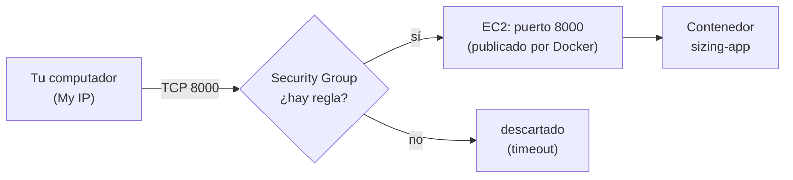

# Actividad 02 — Security Groups

## Objetivo

Comprender por qué una aplicación puede funcionar **dentro** de EC2 y aun así **no ser
accesible desde Internet**, y cómo los Security Groups controlan ese acceso.

## Qué aprenderá

- La diferencia entre `localhost:8000` y `IP_PUBLICA:8000`.
- Qué es una regla *inbound* y qué significa su **origen** (`My IP`, un CIDR, una prefix list).
- Que `docker run -p 8000:8000` publica el puerto **en el sistema operativo de la instancia**,
  pero **no** modifica el Security Group de AWS.
- Qué pasa con EC2 Instance Connect cuando cambias la regla del puerto 22.

## Arquitectura



Dos "puertas" distintas, controladas por dos cosas distintas:

| Puerta | La controla |
| --- | --- |
| Puerto 8000 **de la instancia** hacia el contenedor | Docker (`-p 8000:8000`) |
| Puerto 8000 **de Internet** hacia la instancia | El Security Group de AWS |

## Prerrequisitos

- La instancia de la **Actividad 01**, en estado `Running`, con el contenedor `sizing-app`
  funcionando (`docker ps`). Si estuvo detenida: conéctate y ejecuta `docker start sizing-app`.
- Su Security Group `docker-sizing-sg` solo con la regla SSH de la prefix list.
- La **IP pública actual** de la instancia (consola → pestaña **Networking**).

> En **PowerShell** de Windows, `curl` es un alias de otro comando. Usa **`curl.exe`**.

---

## Paso 1 — Prueba interna: localhost

En la terminal de la instancia (EC2 Instance Connect):

```bash
curl http://localhost:8000/health
sudo ss -tlnp | grep 8000
```

Responde `{"status":"ok"}`. `ss` muestra una línea `LISTEN` en el puerto 8000: Docker abrió ese
puerto **en el sistema operativo** de la instancia. Hasta aquí AWS no ha intervenido.

## Paso 2 — Prueba externa: IP pública (debe fallar)

Ahora, **desde tu computador** (no desde la instancia):

```bash
curl --max-time 5 http://IP_PUBLICA:8000/health
```

La respuesta es un **timeout** (nada responde). La aplicación funciona, pero el Security Group
descarta el tráfico al puerto 8000 porque no existe ninguna regla que lo permita.

| Prueba | Desde dónde | Resultado |
| --- | --- | --- |
| `localhost:8000` | dentro de la instancia | funciona |
| `IP_PUBLICA:8000` | tu computador | **timeout** |

## Paso 3 — Abrir el puerto 8000 solo para tu IP

**EC2 → Instances →** tu instancia **→ pestaña Security →** enlace del Security Group **→ Edit
inbound rules → Add rule**:

| Type | Protocol | Port | Source |
| --- | --- | --- | --- |
| Custom TCP | TCP | 8000 | **My IP** |

Guarda con **Save rules** y repite la prueba del Paso 2. Ahora responde `{"status":"ok"}`.
No reiniciaste ni la instancia ni el contenedor: solo cambió el Security Group.

Ahora sí puedes usar el navegador. Abre la documentación interactiva de FastAPI:

```
http://IP_PUBLICA:8000/docs
```

Verás los tres endpoints (`/health`, `/compute`, `/memory`). Pulsa uno, luego **Try it out** y
**Execute** para llamarlo desde la página. Prueba `/health` y, con los valores por defecto,
`/compute` y `/memory` (los mismos de la Actividad 01). Como el puerto solo está abierto para tu
IP, nadie más puede generar carga en tu instancia.

> **`My IP`** es la IP pública desde la que estás usando la consola en este momento. Si cambias
> de red (por ejemplo, de WiFi a datos móviles), tu IP cambia y dejarás de tener acceso.
>
> Poner `0.0.0.0/0` como origen también funcionaría, pero deja el puerto abierto a **todo
> Internet**. Solo se acepta en un laboratorio de corta duración, y **no** es una configuración
> recomendada para producción.

## Paso 4 — El origen importa

Edita la regla del puerto 8000 y cambia el origen a `192.0.2.1/32` (una dirección reservada para
documentación, que no es la tuya). Guarda y repite la prueba: vuelve el **timeout**.
Restaura el origen a **My IP** y confirma que responde otra vez.

## Paso 5 — El puerto 22 y EC2 Instance Connect

1. **Deja abierta** tu terminal de Instance Connect actual.
2. En el Security Group, **elimina** la regla SSH y guarda.
3. Sin cerrar la terminal actual, intenta abrir **otra** conexión con Connect. Falla.
4. Vuelve a agregar la regla: SSH, TCP, 22, **Custom** →
   `com.amazonaws.us-east-1.ec2-instance-connect`. Confirma que puedes conectarte de nuevo.

La sesión que ya estaba abierta sigue funcionando porque el Security Group es *stateful* (recuerda
las conexiones ya establecidas), pero **una conexión nueva** necesita la regla.

## Paso 6 — `-p` no abre el Security Group

En la terminal de la instancia, publica **otro** contenedor en el puerto 8080:

```bash
docker run -d --name sizing-app-8080 -p 8080:8000 sizing-app
curl http://localhost:8080/health
```

Funciona dentro de la instancia. Ahora, **desde tu computador**:

```bash
curl --max-time 5 http://IP_PUBLICA:8080/health
```

Da timeout: Docker publicó el 8080 en la instancia, pero el Security Group no tiene regla para
ese puerto. Elimina el contenedor de prueba:

```bash
docker rm -f sizing-app-8080
```

---

## Verificación

- [ ] `localhost:8000/health` funciona dentro de la instancia.
- [ ] Sin regla, `IP_PUBLICA:8000` da timeout desde tu computador.
- [ ] Con la regla `TCP 8000 / My IP`, `IP_PUBLICA:8000/health` responde.
- [ ] Abriste `http://IP_PUBLICA:8000/docs` en el navegador y ejecutaste un endpoint con **Try it out**.
- [ ] Con el origen incorrecto (`192.0.2.1/32`), vuelve el timeout.
- [ ] La regla SSH quedó restaurada con la prefix list (no con `0.0.0.0/0`).

## Preguntas de análisis

1. ¿Qué diferencia hay entre `localhost:8000` y `IP_PUBLICA:8000`?
2. ¿Quién decide si el tráfico externo llega al puerto 8000: Docker o el Security Group?
3. ¿Qué hace exactamente `-p 8000:8000`? ¿Qué **no** hace?
4. ¿Por qué el puerto 8000 se abrió a `My IP` y no a `0.0.0.0/0`?
5. ¿Por qué la terminal de Instance Connect que ya estaba abierta siguió funcionando al eliminar
   la regla del puerto 22?

## Limpieza de recursos

- **Si vas a continuar con la Actividad 03:** puedes conservar el Security Group
  `docker-sizing-sg` (lo reutilizaremos). **Termina** la instancia de las actividades 01 y 02:
  **EC2 → Instances → Instance state → Terminate instance**.
- **Si terminaste por hoy:** termina la instancia y, cuando el estado sea `Terminated`, elimina
  el Security Group `docker-sizing-sg`.
