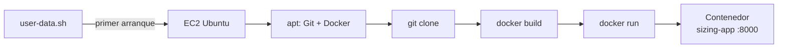

# Actividad 03 — User Data

## Objetivo

Automatizar con un script las tareas que en la Actividad 01 hicimos a mano, de modo que una
instancia **nueva** arranque ya con la aplicación funcionando.

## Qué aprenderá

- Qué es **User Data**: un script que EC2 ejecuta **una sola vez**, como `root`, en el primer
  arranque de la instancia.
- Cómo traducir una lista de pasos manuales a un script.
- Cómo revisar los registros cuando algo falla (los errores del script no se ven en pantalla).

## Arquitectura



Ya no hay que conectarse a la instancia para instalar nada: la aplicación se despliega sola.

## Prerrequisitos

- Haber completado las Actividades 01 y 02.
- El Security Group `docker-sizing-sg` con dos reglas de entrada: SSH desde la prefix list de EC2
  Instance Connect y `TCP 8000` desde **My IP** (Actividad 02). Si lo eliminaste, vuelve a crearlo
  con esas dos reglas.
- Haber terminado (Terminate) la instancia de las actividades 01 y 02.

---

## Paso 1 — Leer el script

Abre [`user-data.sh`](user-data.sh). Cada bloque corresponde a algo que ya hiciste:

| Lo que hicimos a mano (Actividad 01) | Línea del script |
| --- | --- |
| `sudo apt-get update` | `apt-get update -y` |
| `sudo apt-get install -y git docker.io` | `apt-get install -y git docker.io` |
| *(Docker ya arrancaba solo)* | `systemctl enable --now docker` |
| `git clone ...` | `git clone "$REPO_URL" "$APP_DIR"` |
| `docker build -t sizing-app .` | `docker build -t sizing-app .` |
| `docker run -d --name sizing-app -p 8000:8000 sizing-app` | `docker run -d --name sizing-app -p 8000:8000 sizing-app` |

Fíjate en dos diferencias: el script corre como **root**, así que no lleva `sudo`; y no hace falta
`usermod`, porque nadie va a usar Docker de forma interactiva.

## Paso 2 — Lanzar una instancia con el script

**EC2 → Instances → Launch instances**, con los **mismos valores de la Actividad 01** (Ubuntu
24.04, `t3.micro`, sin key pair, VPC y subnet por defecto en `us-east-1a`, IP pública habilitada,
20 GiB `gp3`, Security Group existente `docker-sizing-sg`).

Antes de lanzar, abre **Advanced details**, baja hasta **User data** y **pega el contenido
completo** de `user-data.sh` (desde `#!/bin/bash`). Pulsa **Launch instance**.

## Paso 3 — Esperar y verificar

El script tarda **2 a 4 minutos** después de que la instancia esté `Running`. Conéctate con EC2
Instance Connect y ejecuta:

```bash
cloud-init status --wait
```

Cuando termine debe decir `status: done`. Luego:

```bash
sudo docker ps
curl http://localhost:8000/health
```

(Aquí usamos `sudo docker` porque el usuario `ubuntu` no fue agregado al grupo `docker`.)

Por último, desde **tu computador**, con la IP pública de la nueva instancia:

```bash
curl http://IP_PUBLICA:8000/health
```

### Si algo falla

El script no muestra errores en pantalla. Lee el registro:

```bash
sudo tail -n 50 /var/log/cloud-init-output.log
```

Como el script usa `set -e`, se detiene en el primer comando que falla: la última línea del
registro te dice cuál.

---

## Verificación

- [ ] `cloud-init status --wait` termina con `status: done`.
- [ ] `sudo docker ps` muestra `sizing-app` con estado `Up`.
- [ ] `curl http://IP_PUBLICA:8000/health` responde desde tu computador.
- [ ] No ejecutaste a mano ningún `apt`, `git clone`, `docker build` ni `docker run`.

## Preguntas de análisis

1. Completa la comparación:

   | | Manual (Act. 01) | Script (User Data) |
   | --- | --- | --- |
   | ¿Quién ejecuta los comandos? | | |
   | ¿Se puede repetir igual en otra instancia? | | |
   | ¿Cuánto tarda hasta ver la aplicación? | | |
   | ¿Cómo te enteras de un error? | | |

2. ¿Cuántas veces ejecuta EC2 el User Data? ¿Qué pasaría si cambias el script con la instancia
   ya creada?
3. ¿Por qué no debes poner contraseñas ni llaves dentro de un User Data?
4. ¿Qué parte del proceso **sigue** siendo manual? (Pista: la creación de la instancia y del
   Security Group.)

## Limpieza de recursos

1. **EC2 → Instances →** selecciona la instancia **→ Instance state → Terminate instance**.
2. Cuando la instancia esté `Terminated`, elimina el Security Group `docker-sizing-sg`:
   desde la siguiente actividad, Terraform crea su propio Security Group.
