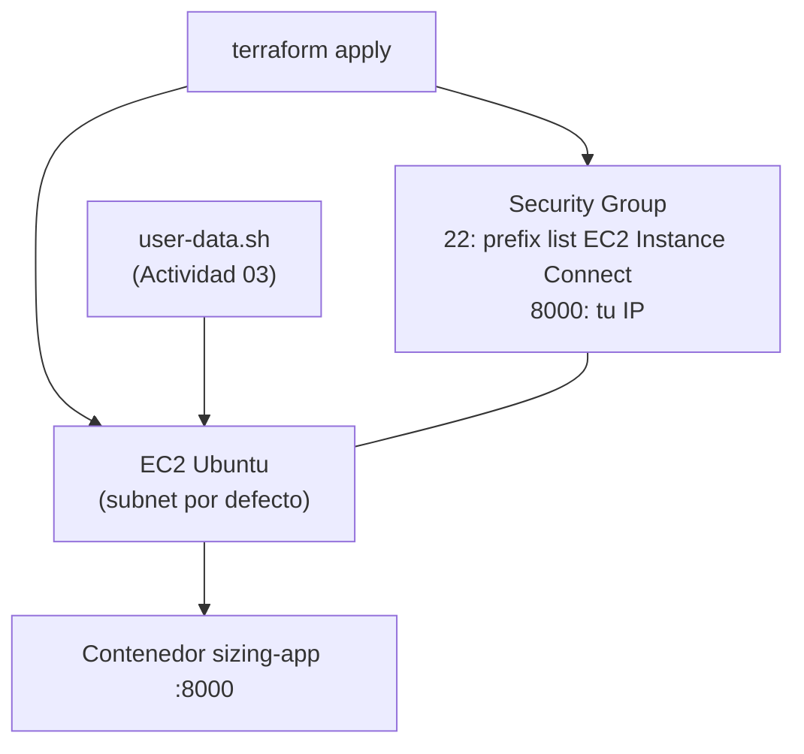

# Actividad 04 — Terraform EC2

## Objetivo

Crear con **Terraform** los recursos que antes creaste a mano en la consola: un Security Group y
una instancia EC2 que despliega la misma aplicación con el mismo `user-data.sh`.

## Qué aprenderá

- Qué es la **infraestructura como código**: describir en archivos lo que antes hacías con clics.
- El ciclo de Terraform: `init` → `plan` → `apply` → `destroy`.
- La diferencia entre **crear** un recurso y **consultar** uno que ya existe (`data`).
- Cómo el Security Group referencia la prefix list de EC2 Instance Connect **sin escribir IPs**.

## Arquitectura

Se usa la **VPC por defecto** del Sandbox (aún no creamos una red).



| Recurso | Manual (Act. 01–03) | Terraform |
| --- | --- | --- |
| VPC y subnet | ya existían (por defecto) | `data` (se consultan) |
| Prefix list de EC2 Instance Connect | la elegías en la consola | `data` (se consulta) |
| Security Group y sus reglas | consola | `resource` (se crea) |
| Instancia EC2 | consola | `resource` (se crea) |
| Script de arranque | pegado en *User data* | `file(...)` del mismo `user-data.sh` |

## Prerrequisitos

- Actividades 01 a 03 completadas (y sus instancias terminadas).
- **Terraform** instalado en tu computador (>= 1.5): <https://developer.hashicorp.com/terraform/install>.
  Comprueba con `terraform version`.
- **Credenciales temporales del Sandbox.** En AWS Academy, abre **AWS Details → AWS CLI → Show**
  y copia los tres valores en el archivo `~/.aws/credentials`
  (en Windows: `C:\Users\TU_USUARIO\.aws\credentials`):

  ```ini
  [default]
  aws_access_key_id=...
  aws_secret_access_key=...
  aws_session_token=...
  ```

  > ⚠️ Estas credenciales **caducan al terminar la sesión del laboratorio**: repite este paso cada
  > vez que hagas *Start Lab*. **Nunca** las subas a GitHub.
- Tu **IP pública**: ábrela en <https://checkip.amazonaws.com>.

---

## Paso 1 — Leer el código

Abre la carpeta [`terraform/`](terraform/):

| Archivo | Qué contiene |
| --- | --- |
| `main.tf` | los datos consultados y los recursos a crear |
| `variables.tf` | los valores que puedes cambiar |
| `outputs.tf` | lo que Terraform te muestra al terminar (IP, URL) |

Fíjate en cómo se referencia la lista de prefijos, sin escribir ninguna IP:

```hcl
data "aws_ec2_managed_prefix_list" "instance_connect" {
  name = "com.amazonaws.${var.aws_region}.ec2-instance-connect"
}

resource "aws_vpc_security_group_ingress_rule" "ssh_instance_connect" {
  ...
  from_port      = 22
  to_port        = 22
  prefix_list_id = data.aws_ec2_managed_prefix_list.instance_connect.id
}
```

Y cómo el puerto de la aplicación es una regla **separada** del puerto administrativo:

```hcl
resource "aws_vpc_security_group_ingress_rule" "app" {
  ...
  from_port = 8000
  to_port   = 8000
  cidr_ipv4 = var.my_ip_cidr
}
```

## Paso 2 — Indicar tu IP

Dentro de `terraform/`, crea un archivo `terraform.tfvars` con **una línea** (cambia el valor por
tu IP y deja `/32`):

```hcl
my_ip_cidr = "203.0.113.25/32"
```

Este archivo está en `.gitignore`: no se sube a GitHub.

## Paso 3 — Crear la infraestructura

```bash
cd actividades/04-terraform-ec2/terraform
terraform init
terraform plan
terraform apply
```

- `init` descarga el proveedor de AWS.
- `plan` muestra **qué se va a crear** sin crear nada. Léelo: deben ser 5 recursos (Security
  Group, 3 reglas y la instancia).
- `apply` lo crea. Escribe `yes` cuando lo pida.

Al terminar, Terraform imprime los *outputs*: `instance_id`, `public_ip`, `private_ip` y
`health_url`.

## Paso 4 — Probar

Espera **2 a 4 minutos** (el User Data está instalando y construyendo). Luego, desde tu computador:

```bash
curl http://IP_PUBLICA:8000/health
```

En la consola de AWS revisa la instancia (`docker-sizing-terraform`) y su Security Group
(`docker-sizing-terraform-sg`): el puerto 22 debe tener como origen la **prefix list** y el 8000
tu IP.

Opcional: conéctate con **Connect → EC2 Instance Connect** y ejecuta `cloud-init status --wait`.

### Si `terraform plan` falla al consultar la prefix list

Si el Sandbox no permite consultarla (`AccessDenied`) o no existe en tu región, avisa al docente.
La alternativa es reemplazar `prefix_list_id` por el rango del servicio para tu región, publicado
en <https://ip-ranges.amazonaws.com/ip-ranges.json> (`"service": "EC2_INSTANCE_CONNECT"`):

```hcl
cidr_ipv4 = "18.206.107.24/29"   # us-east-1 al escribir esta guía; confirma el valor vigente
```

**Nunca** uses `0.0.0.0/0` para el puerto 22.

---

## Verificación

- [ ] `terraform apply` termina sin errores y muestra los outputs.
- [ ] `curl http://IP_PUBLICA:8000/health` responde `{"status":"ok"}`.
- [ ] En la consola, el puerto 22 del Security Group usa la prefix list (no `0.0.0.0/0`).
- [ ] Un segundo `terraform plan` dice `No changes`.

## Preguntas de análisis

1. ¿Qué diferencia hay entre un bloque `data` y un bloque `resource`?
2. ¿Por qué el puerto 22 y el puerto 8000 son dos reglas separadas y con orígenes distintos?
3. ¿Qué ventaja tiene referenciar la prefix list en lugar de escribir sus IP a mano?
4. ¿Qué pasa si ejecutas `terraform apply` dos veces seguidas?
5. Compara con la Actividad 03: ¿qué se automatizó ahora que antes era manual?

## Limpieza de recursos

Desde la misma carpeta `terraform/`:

```bash
terraform destroy
```

Escribe `yes`. Terraform elimina la instancia y el Security Group. Verifica en la consola que la
instancia esté `Terminated`.

> Destruye siempre con `terraform destroy` (no a mano en la consola): así el estado de Terraform
> coincide con lo que realmente existe. Si la sesión del laboratorio terminó, renueva antes las
> credenciales (Prerrequisitos).
