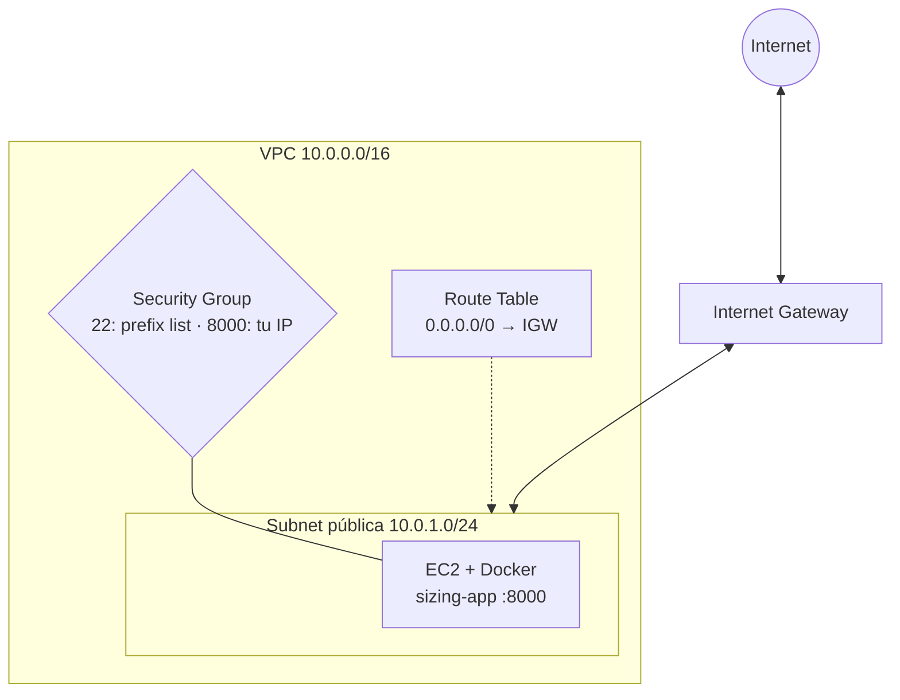

# Actividad 05 — Terraform VPC

## Objetivo

Dejar de depender de la red por defecto y **construir tu propia red** con Terraform, para
desplegar en ella la misma aplicación.

## Qué aprenderá

- Qué es una **VPC** y qué piezas necesita una instancia para ser accesible desde Internet.
- La función de la **subnet pública**, el **Internet Gateway**, la **Route Table** y su
  **asociación**.
- Que la aplicación, el `user-data.sh` y las reglas de seguridad **no cambian**: solo cambia la red.

## Arquitectura



| Pieza | Para qué sirve |
| --- | --- |
| **VPC** | tu red privada dentro de AWS |
| **Subnet pública** | un pedazo de la VPC donde vive la instancia |
| **Internet Gateway** | la puerta entre la VPC e Internet |
| **Route Table** | dice a dónde va el tráfico: `0.0.0.0/0` (todo lo externo) sale por el Internet Gateway |
| **Asociación de rutas** | conecta esa Route Table con la subnet |
| **Security Group** | igual que en la Actividad 04 |
| **EC2** | igual que en la Actividad 04 |

Sin la ruta al Internet Gateway, la instancia no podría ni descargar paquetes (el User Data
fallaría) ni recibir tráfico.

## Prerrequisitos

- Actividad 04 completada y **destruida** (`terraform destroy`).
- Terraform y credenciales del Sandbox configurados (ver [Actividad 04](../04-terraform-ec2/README.md)).
- Tu IP pública: <https://checkip.amazonaws.com>.

> El Sandbox limita las VPC por región (normalmente 5). Esta actividad crea una; recuerda
> destruirla al terminar.

---

## Paso 1 — Leer la red

Abre [`terraform/main.tf`](terraform/main.tf). Las piezas nuevas están numeradas del 1 al 5 en la
sección **Red**. Compara con la Actividad 04: el Security Group y la instancia casi no cambian,
salvo que ahora pertenecen a **tu** VPC y **tu** subnet:

```hcl
vpc_id    = aws_vpc.main.id      # antes: data.aws_vpc.default.id
subnet_id = aws_subnet.public.id # antes: data.aws_subnets.default.ids[0]
```

## Paso 2 — Indicar tu IP

En `terraform/`, crea `terraform.tfvars` con una línea:

```hcl
my_ip_cidr = "203.0.113.25/32"
```

## Paso 3 — Crear la infraestructura

```bash
cd actividades/05-terraform-vpc/terraform
terraform init
terraform plan
terraform apply
```

En el `plan` cuenta los recursos: VPC, subnet, Internet Gateway, Route Table, asociación,
Security Group, 3 reglas y la instancia (**10 recursos**). Escribe `yes` para aplicar.

## Paso 4 — Recorrer la red en la consola

En **VPC → Your VPCs** localiza `vpc-docker-sizing` y comprueba:

1. **Subnets**: `subnet-publica-docker-sizing` (`10.0.1.0/24`).
2. **Internet gateways**: `igw-docker-sizing`, *Attached* a tu VPC.
3. **Route tables**: `rt-publica-docker-sizing` tiene dos rutas: `10.0.0.0/16 → local` y
   `0.0.0.0/0 → igw-...`.
4. En **EC2 → Instances**, la instancia `docker-sizing-vpc`, pestaña **Networking**: su VPC y
   subnet son las nuevas, no las por defecto.

## Paso 5 — Probar

Espera **2 a 4 minutos** y, desde tu computador:

```bash
curl http://IP_PUBLICA:8000/health
```

(La URL exacta aparece en el output `health_url`.)

---

## Verificación

- [ ] `terraform apply` crea los 10 recursos sin errores.
- [ ] `curl http://IP_PUBLICA:8000/health` responde `{"status":"ok"}`.
- [ ] La Route Table tiene la ruta `0.0.0.0/0` hacia el Internet Gateway.
- [ ] El puerto 22 del Security Group sigue usando la prefix list de EC2 Instance Connect.

## Preguntas de análisis

1. ¿Qué diferencia hay entre la subnet de esta actividad y la subnet por defecto de la
   Actividad 04?
2. ¿Qué haría falta para que esta subnet fuera **privada** (sin acceso directo desde Internet)?
3. ¿Qué pasaría si no existiera la asociación entre la Route Table y la subnet?
4. ¿Qué pasaría si se eliminara la ruta `0.0.0.0/0` hacia el Internet Gateway? ¿Seguiría
   funcionando `curl` desde tu computador? ¿Y el `user-data.sh` en un arranque nuevo?
5. ¿Qué cambió y qué **no** cambió respecto a la Actividad 04?

## Limpieza de recursos

```bash
terraform destroy
```

Escribe `yes`. Terraform elimina, en el orden correcto, la instancia, el Security Group y la red.
Verifica en **VPC → Your VPCs** que `vpc-docker-sizing` ya no existe.
