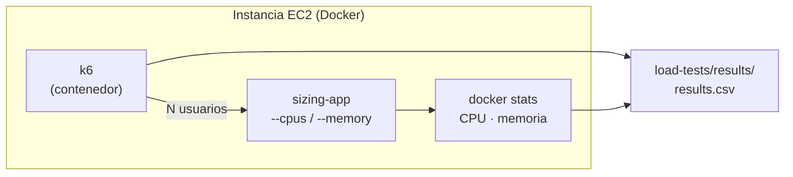

# Actividad 06 — Dimensionamiento

## Objetivo

Medir cuántos recursos necesita la aplicación bajo carga y traducir esa medición a la elección
de un **tipo de instancia EC2**.

**Pregunta que vas a responder:** si tuvieras que llevar esta aplicación a producción, ¿cuántas
vCPU y cuánta RAM necesitarías? Al empezar no lo sabes; al terminar lo habrás medido tú.

## Qué aprenderá

- Generar carga con **k6** y leer `docker stats`.
- Relacionar **usuarios concurrentes**, **requests por segundo**, **CPU**, **memoria**,
  **latencia promedio**, **p95** y **porcentaje de errores**.
- Encontrar la configuración **mínima que cumple** unos criterios de servicio (no la más grande).
- Traducir el resultado a un tipo de instancia EC2.

## Arquitectura



Usaremos los límites de Docker (`--cpus`, `--memory`) para **simular** contenedores de distintos
tamaños dentro de una sola instancia.

Endpoints de la aplicación: `/health` (sin consumo), `/compute` (consume CPU: cuenta primos por
fuerza bruta, `?n=`) y `/memory` (reserva `mb` megabytes durante `hold_seconds` segundos). Las
pruebas de carga golpean `/compute`. Ya los exploraste en el Paso 7 de la
[Actividad 01](../01-ec2-manual/README.md).

## Prerrequisitos

- Una instancia Ubuntu con Docker, Git y este repositorio clonado, y tu usuario en el grupo
  `docker` (los pasos 4 y 5 de la [Actividad 01](../01-ec2-manual/README.md)). Si tu instancia vino
  de User Data, ejecuta `sudo usermod -aG docker ubuntu`, reconéctate y clona el repositorio en
  tu carpeta `home`.
- Una instancia con **al menos 2 vCPU y 4 GiB de RAM** (`t3.medium`, o la más grande que permita
  tu Sandbox). Una `t3.micro` (1 GiB) no alcanza para las configuraciones grandes, y k6 corre en
  la misma máquina que la aplicación.

> **Redimensionar es parte del ejercicio.** Con la instancia de la Actividad 01: **Instance state
> → Stop instance**; luego **Actions → Instance settings → Change instance type →** `t3.medium`;
> luego **Start instance**. El disco se conserva (Docker y el repositorio siguen ahí), pero la
> **IP pública cambia**. Reconéctate con EC2 Instance Connect y ejecuta `docker start sizing-app`
> si lo necesitas.

---

## Paso 1 — Línea base

```bash
cd ~/aws-infrastructure-labs
git pull
./load-tests/start_container.sh 1 512m
curl http://localhost:8000/compute
```

`start_container.sh` reconstruye la imagen y arranca el contenedor con **1 CPU y 512 MB**.
Observa `elapsed_ms` en la respuesta de `/compute`: es lo que tarda **una sola** petición.

> Si `Permission denied` al ejecutar el script: `chmod +x load-tests/*.sh` y reintenta.

## Paso 2 — Medir en reposo

```bash
docker stats sizing-app
```

Sal con `Ctrl+C` (no detiene el contenedor).

- **CPU %**: `100%` ≈ un núcleo completo. `200%` = dos núcleos.
- **MEM USAGE / LIMIT**: memoria usada frente al límite del contenedor.

## Paso 3 — Primera prueba de carga

```bash
./load-tests/load_test.sh 10
```

Lanza k6 (en un contenedor, sin instalar nada) contra `/compute` durante 30 s con 10 usuarios
concurrentes, muestrea `docker stats` y agrega una fila a `load-tests/results/results.csv`. Al
terminar imprime `requests_per_second`, `avg_latency_ms`, `p95_latency_ms`, `error_percent` y el
**máximo** de CPU y memoria (se usa el pico y no el promedio porque para dimensionar importa el
peor momento).

> **p95** significa que el 95 % de las peticiones tardó eso o menos. Se usa porque el promedio
> esconde a los usuarios que sí sufrieron una respuesta lenta.

## Paso 4 — Limitar recursos y repetir

```bash
./load-tests/start_container.sh 0.5 256m
./load-tests/load_test.sh 10
```

Compara `p95_latency_ms` y `error_percent` con el Paso 3.

## Paso 5 — Toda la matriz

Se prueban 4 configuraciones × 5 niveles de usuarios (1, 10, 25, 50 y 100):

| Config | CPU | RAM |
| --- | --- | --- |
| A | 0.5 | 256 MB |
| B | 1 | 512 MB |
| C | 1 | 1 GB |
| D | 2 | 2 GB |

```bash
./load-tests/run_experiment.sh
```

Son 20 corridas de 15 s (unos 10 minutos con los reinicios). Puedes acotar la matriz:
`./load-tests/run_experiment.sh "10 50" 20` (solo 10 y 50 usuarios, 20 s cada una). Al final,
`load-tests/results/results.csv` tiene una fila por corrida, con estas columnas:

```
timestamp, cpu_limit, memory_limit, concurrent_users,
cpu_percent, memory_usage_mb,
requests_per_second, avg_latency_ms, p95_latency_ms, error_percent
```

Si una corrida no pudo registrarse (por ejemplo, el contenedor murió por falta de memoria),
anótala a mano en el CSV: es evidencia de que esa configuración **no** alcanza.

## Paso 6 — Analizar y proponer el dimensionamiento

Busca la **configuración mínima que cumple todos** estos criterios para **50 usuarios
concurrentes** (son criterios didácticos, no reglas universales de producción):

```
errores < 1 %
p95 < 500 ms
sin saturación sostenida de CPU (cpu_percent no permanece pegado al límite)
memoria utilizada < 80 % del límite del contenedor
```

Completa:

```
Carga objetivo: 50 usuarios concurrentes

Configuración mínima que cumple:   CPU: ...   RAM: ...
p95 obtenido: ...            errores: ...
CPU máxima observada: ...    RAM máxima observada: ...

Dimensionamiento recomendado: ... vCPU y ... GB de RAM
```

## Paso 7 — Traducirlo a un tipo de instancia EC2

Busca en la [documentación de tipos de instancia](https://docs.aws.amazon.com/ec2/latest/instancetypes/instance-types.html)
la instancia más pequeña que cubra tu "Dimensionamiento recomendado". Como referencia:

| Tipo | vCPU | RAM |
| --- | --- | --- |
| `t3.micro` | 2 | 1 GiB |
| `t3.small` | 2 | 2 GiB |
| `t3.medium` | 2 | 4 GiB |
| `t3.large` | 2 | 8 GiB |

Las `t3` son instancias **con ráfagas** (*burstable*): pueden usar toda la CPU por periodos
cortos, pero bajo carga sostenida agotan sus créditos de CPU. Tenlo presente al interpretar una
prueba de 15 segundos.

---

## Verificación

- [ ] `load-tests/results/results.csv` tiene las filas de la matriz (o de la matriz acotada).
- [ ] Puedes señalar en el CSV la primera configuración con `error_percent > 0`.
- [ ] Completaste la conclusión del Paso 6 con datos de **tu** CSV.
- [ ] Nombraste un tipo de instancia EC2 justificado con esos datos.

> **Alcance de la conclusión:** es válida únicamente para *esta* aplicación, *esta* carga y
> *este* entorno (el tipo de instancia donde corriste las pruebas, con k6 compartiendo la
> máquina). Una carga real o un entorno distinto pueden dar otro resultado.

## Preguntas de análisis

1. Al aumentar los usuarios, ¿qué subió más rápido: `cpu_percent` o `memory_usage_mb`? ¿Esta
   aplicación está limitada por CPU o por memoria?
2. ¿En qué configuración apareció `error_percent > 0` y con cuántos usuarios?
3. ¿En qué punto duplicar recursos (por ejemplo, de B a D) dejó de mejorar el `p95`? ¿Por qué?
4. ¿Qué configuración habrías elegido mirando solo la latencia promedio? ¿Habría sido un error?
5. ¿El tipo de instancia que elegiste da *exactamente* lo que necesitas o te obliga a
   sobredimensionar? ¿Por qué los tamaños vienen en pasos fijos?
6. Si el tráfico tuviera picos impredecibles, ¿seguirías reservando un tamaño fijo? ¿Qué otras
   opciones consideraría un arquitecto?

## Limpieza de recursos

```bash
./load-tests/stop_container.sh
```

Luego termina la instancia: **EC2 → Instances → Instance state → Terminate instance**. Si la
redimensionaste a `t3.medium`, es aún más importante no dejarla encendida. Elimina también el
Security Group `docker-sizing-sg` cuando la instancia esté `Terminated`.
