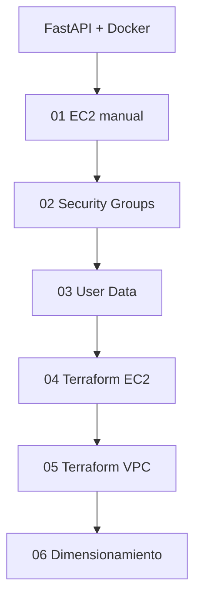
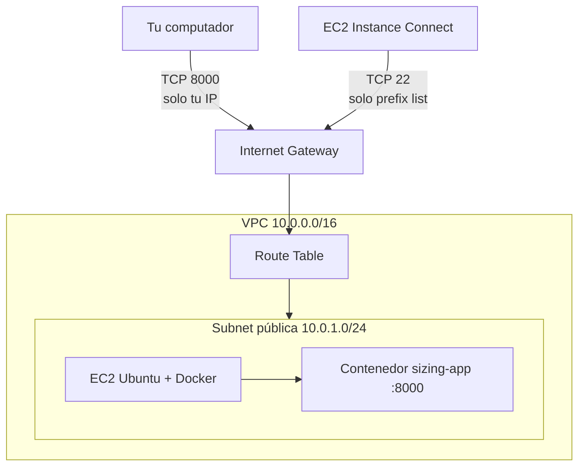

# Arquitectura y progresión

## Qué permanece y qué cambia

| Permanece igual en todas las actividades | Cambia en cada actividad |
| --- | --- |
| `app/` (FastAPI) | cómo se crea la infraestructura |
| `Dockerfile` y `requirements.txt` | cómo se despliega la aplicación |
| El puerto de la aplicación: **8000** | la red y las reglas de acceso |

## Progresión

| Actividad | Quién crea la infraestructura | Quién despliega la app | Red |
| --- | --- | --- | --- |
| 01 | tú, en la consola | tú, por Instance Connect | VPC por defecto |
| 02 | tú, en la consola | (ya desplegada) | VPC por defecto |
| 03 | tú, en la consola | `user-data.sh` | VPC por defecto |
| 04 | Terraform | `user-data.sh` | VPC por defecto |
| 05 | Terraform | `user-data.sh` | VPC propia |
| 06 | (instancia existente) | tú + scripts de `load-tests/` | la de la actividad 01 |

## Arquitectura final (actividad 05)

## Puertos y accesos

| Puerto | Uso | Origen permitido | Nunca |
| --- | --- | --- | --- |
| 22 | administración (SSH) | prefix list `com.amazonaws.<región>.ec2-instance-connect` (o `My IP` si se usa SSH desde un equipo local) | `0.0.0.0/0` |
| 8000 | aplicación | `My IP` | `0.0.0.0/0` salvo laboratorio muy corto y explícito |

## Restricciones del Sandbox de AWS Academy que condicionan el diseño

- Región `us-east-1` e instancias pequeñas (`t3.micro` a `t3.medium`). El recorrido evita a
  propósito servicios adicionales (ECR, ECS, EKS, Load Balancer) para no depender de permisos
  del Sandbox ni de costos innecesarios.
- No se usa la instancia preconfigurada del laboratorio (poco almacenamiento): se crea una
  propia con un disco de 20 GiB.
- Las credenciales del Sandbox son temporales y caducan al terminar la sesión; al reiniciar una
  instancia detenida, su IP pública cambia.
